# Explainable AI (XAI) for Sustainable Housing Policy

An analysis leveraging Explainable AI techniques to derive actionable insights for sustainable housing policy using the [USA Real Estate Dataset](https://www.kaggle.com/datasets/ahmedshahriarsakib/usa-real-estate-dataset).

## Overview

This project applies machine learning and Explainable AI (XAI) methods to understand the key factors driving housing prices across the United States. By making model predictions transparent and interpretable, we aim to inform sustainable housing policy decisions around affordability, land use efficiency, and equitable development.

## Key Features

- **Exploratory Data Analysis (EDA)**: Comprehensive analysis of 2.2M+ real estate listings across all US states
- **Sustainability-Focused Feature Engineering**: Price per square foot, land use efficiency, density metrics, and affordability indices
- **Predictive Modeling**: 4 models — Linear Regression (baseline), Decision Tree, Random Forest, XGBoost
- **5-Fold Cross-Validation**: Rigorous evaluation with 95% confidence intervals
- **Ablation Study**: Impact of sustainability-engineered features
- **Fairness Analysis**: Prediction equity across price ranges and states
- **Explainable AI (XAI)**:
  - **SHAP (SHapley Additive exPlanations)**: Global and local feature importance, interaction effects, and dependence plots
  - **LIME (Local Interpretable Model-agnostic Explanations)**: Instance-level explanations for individual predictions
  - **Feature Importance**: Built-in feature importance with cross-method validation
- **Policy Insights**: Data-driven recommendations for sustainable housing policy

## Key Results

| Model | Test R² | Test MAE |
|-------|:-------:|:--------:|
| Linear Regression | 0.4210 | $195,183 |
| Decision Tree | 0.7116 | $132,859 |
| Random Forest | 0.7291 | $130,386 |
| **XGBoost** | **0.7547** | **$122,981** |

- XGBoost achieves **79.3% improvement** over the Linear Regression baseline
- Location (ZIP code + state) accounts for **41%+** of price impact
- XAI method consistency: Spearman ρ = 0.661–0.891

---

## Output Visualizations

### 1. Exploratory Data Analysis

#### Price Distribution
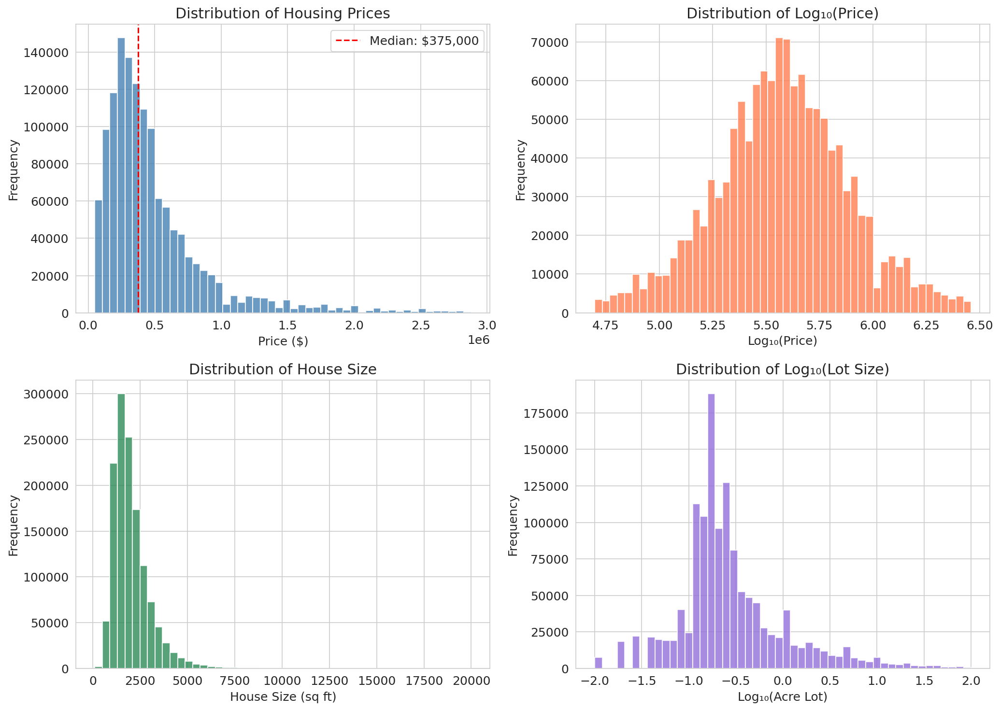

#### Correlation Matrix
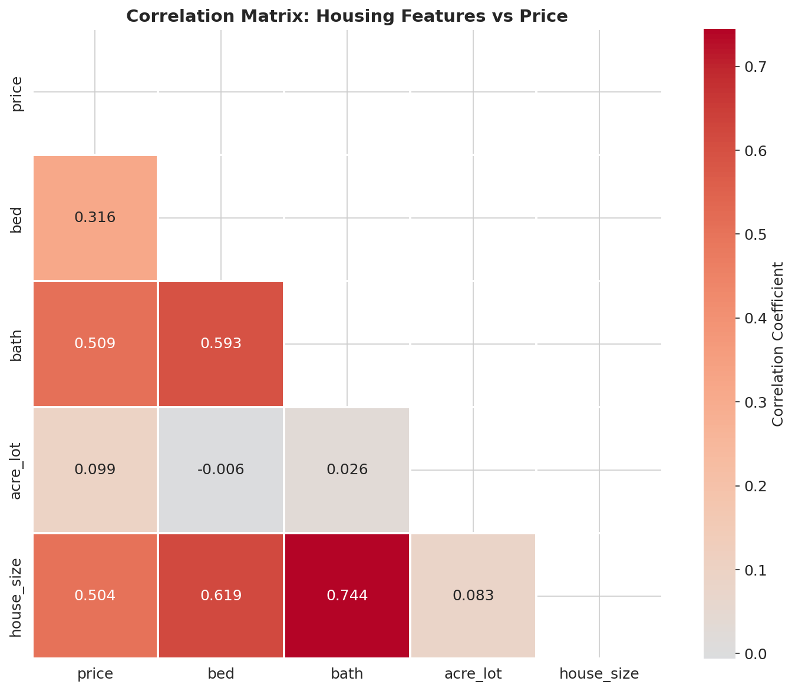

#### Scatter Analysis
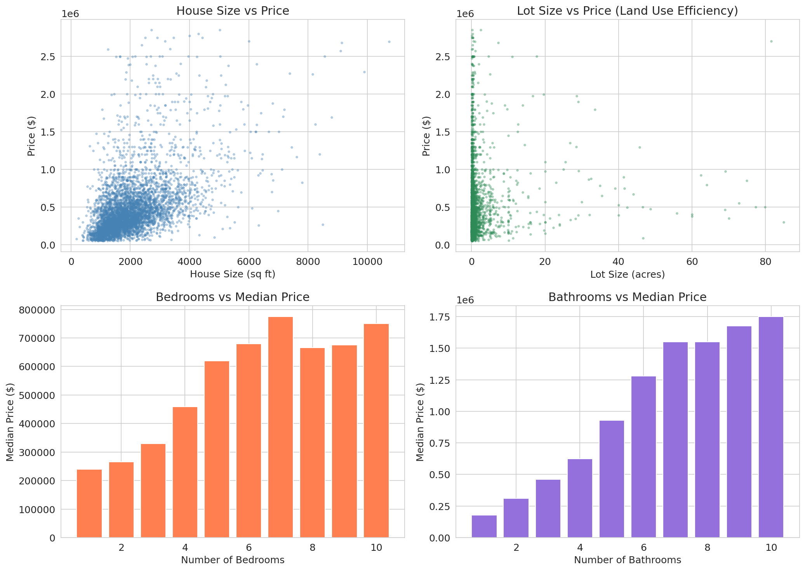

### 2. Model Performance

#### Model Comparison — Actual vs Predicted
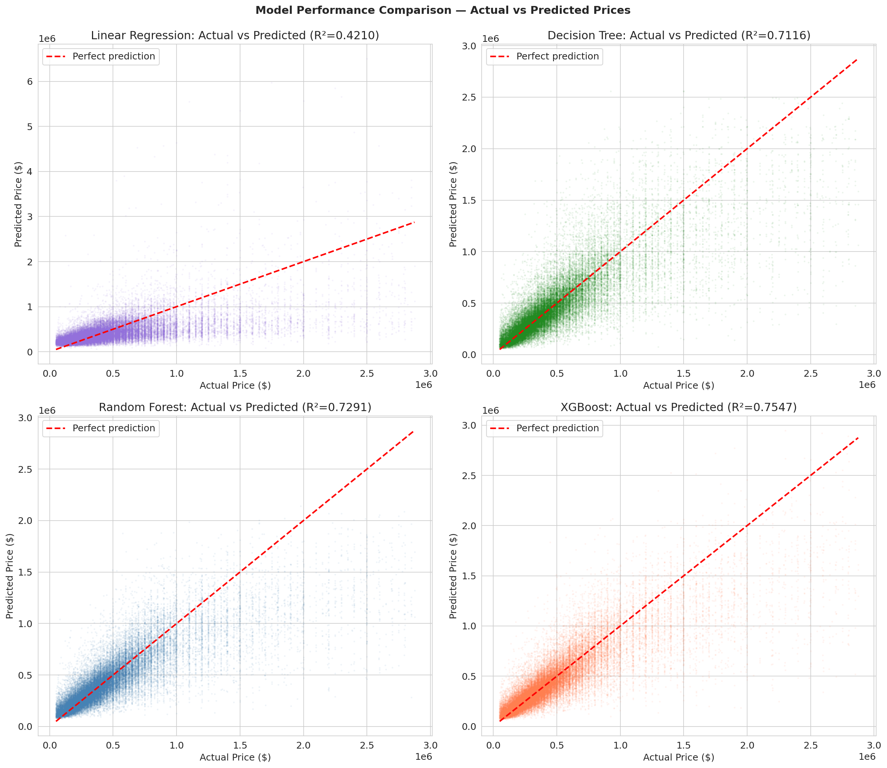

#### Model Comparison — R² Scores
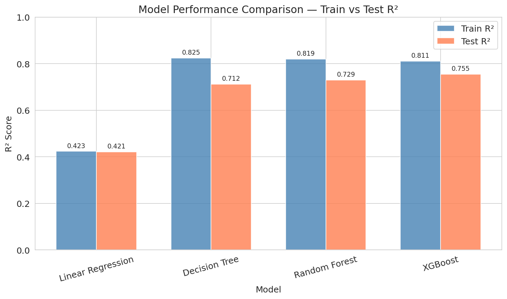

### 3. Cross-Validation

#### 5-Fold Cross-Validation Results
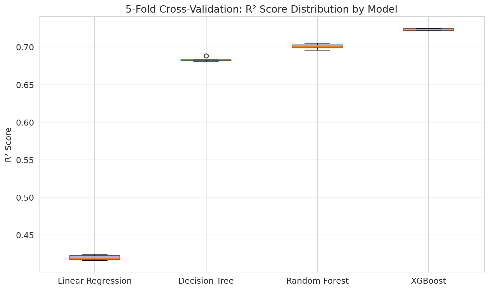

### 4. Ablation Study

#### Impact of Sustainability Features
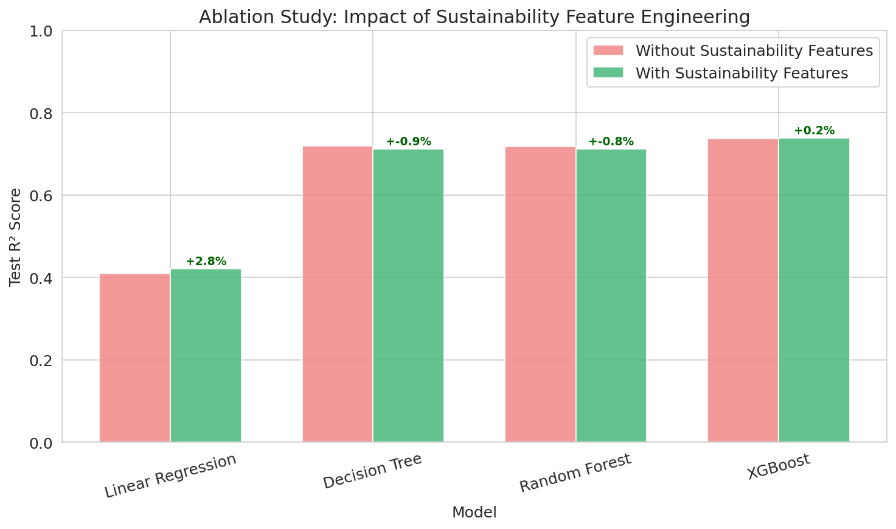

### 5. SHAP Analysis

#### SHAP Summary (Beeswarm Plot)
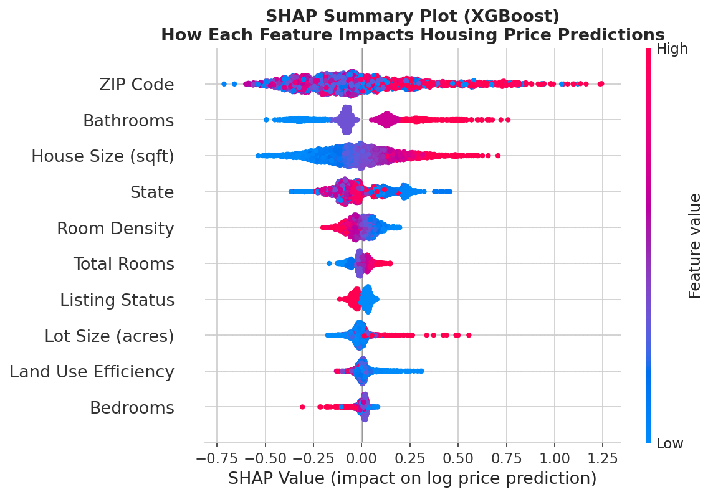

#### SHAP Bar Plot — Feature Importance
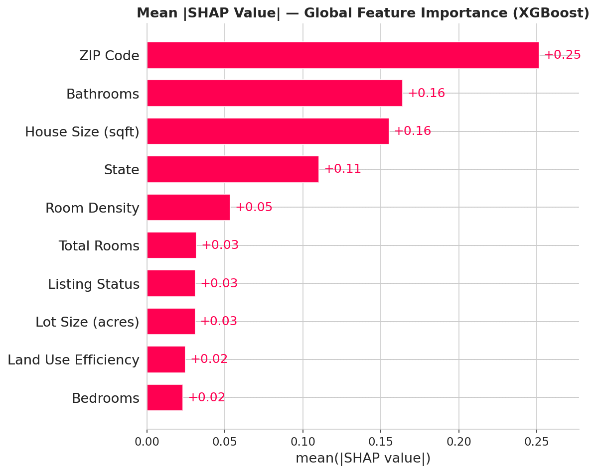

#### SHAP Dependence Plots
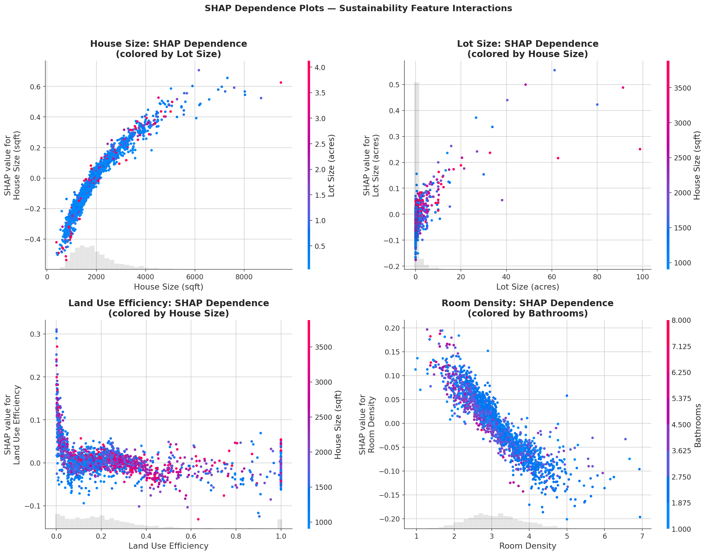

#### SHAP Waterfall Plots
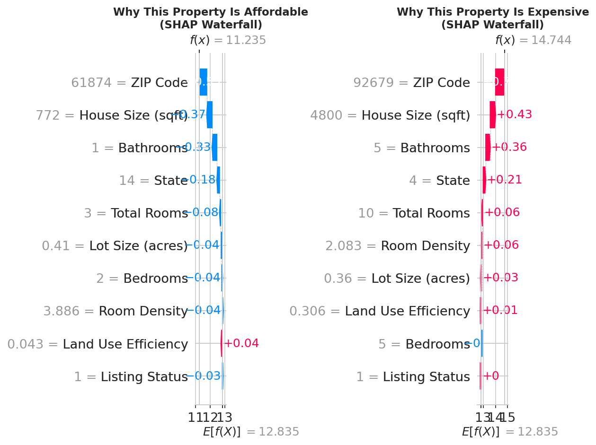

### 6. Feature Importance Comparison
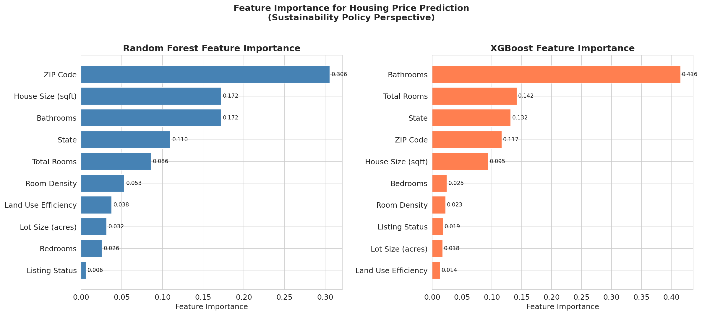

### 7. LIME Explanations
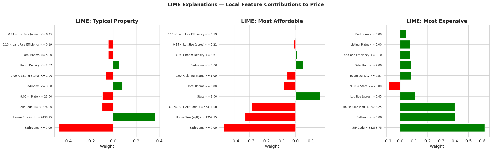

### 8. Fairness Analysis
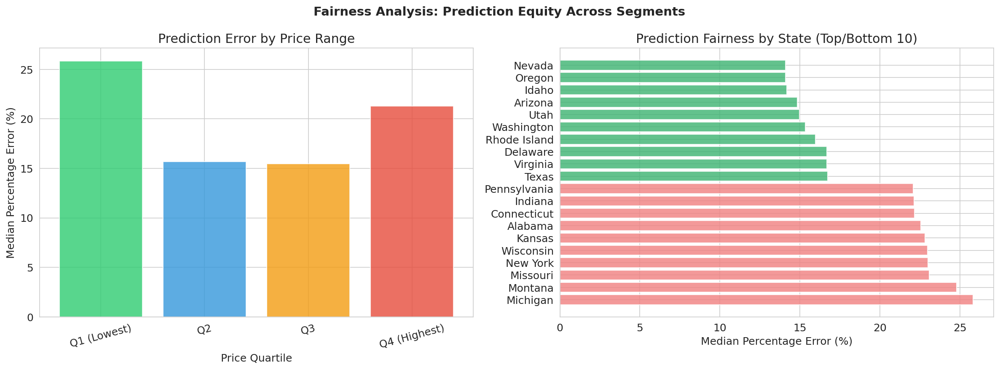

---

## Project Structure

```
xai-sustainable-housing/
├── README.md                              # This file
├── PROJECT_REPORT.md                      # 9-section project report
├── RESEARCH_PAPER.md                      # Full academic research paper (27 references)
├── requirements.txt                       # Python dependencies
├── download_data.py                       # Dataset download script
├── .gitignore
├── data/                                  # Dataset (not tracked in git)
│   └── realtor-data.csv
├── notebooks/
│   └── xai_sustainable_housing.ipynb      # Main analysis notebook (45 cells)
└── outputs/                               # Generated visualizations (14 PNGs)
    ├── price_distribution.png
    ├── correlation_matrix.png
    ├── scatter_analysis.png
    ├── model_performance.png
    ├── model_comparison_bar.png
    ├── cross_validation.png
    ├── ablation_study.png
    ├── feature_importance.png
    ├── shap_summary.png
    ├── shap_bar.png
    ├── shap_dependence.png
    ├── shap_waterfall.png
    ├── lime_explanations.png
    └── fairness_analysis.png
```

## Getting Started

### Prerequisites

- Python 3.10+
- pip

### Installation

```bash
# Clone the repository
git clone https://github.com/nazrana-nahreen/xai-sustainable-housing.git
cd xai-sustainable-housing

# Install dependencies
pip install -r requirements.txt

# Download the dataset
python download_data.py
```

### Running the Analysis

```bash
jupyter notebook notebooks/xai_sustainable_housing.ipynb
```

## Methodology

### 1. Data Preprocessing
- Handle missing values and outliers
- Filter to relevant property types and price ranges ($10K–$5M)
- 2,226,382 raw records → 1,317,749 cleaned records

### 2. Feature Engineering
- **Price per Square Foot**: Housing cost efficiency metric
- **Land Use Efficiency**: Ratio of house size to lot size
- **Room Density**: Rooms per 1,000 square feet
- **Affordability Index**: State-level affordability classification
- **Property Size Categories**: Small, modest, medium, large, luxury

### 3. Model Training
- **Linear Regression**: Baseline model
- **Decision Tree**: Single interpretable tree
- **Random Forest**: Ensemble method with bagging
- **XGBoost**: Gradient boosting with regularization
- 200K training samples, 5-fold cross-validation

### 4. Explainability Analysis
- **Global Explanations**: Which features matter most across all predictions?
- **Local Explanations**: Why was a specific property priced this way?
- **Interaction Effects**: How do features interact to influence price?
- **Ablation Study**: Do sustainability features improve predictions?
- **Fairness Analysis**: Are predictions equitable across regions and price ranges?

### 5. Policy Recommendations
1. **Promote compact development** — land use efficiency impacts affordability
2. **Incentivize right-sized housing** (1,000–1,500 sqft)
3. **Address regional disparities** — location accounts for 41%+ of price variation
4. **Optimize room configurations** — efficient floor plans improve affordability
5. **Adopt explainable AI** in housing assessments for transparency

## License

This project is for educational and research purposes.

## Dataset Citation

Ahmed Shahriar Sakib. (2023). USA Real Estate Dataset. Kaggle.
https://www.kaggle.com/datasets/ahmedshahriarsakib/usa-real-estate-dataset
